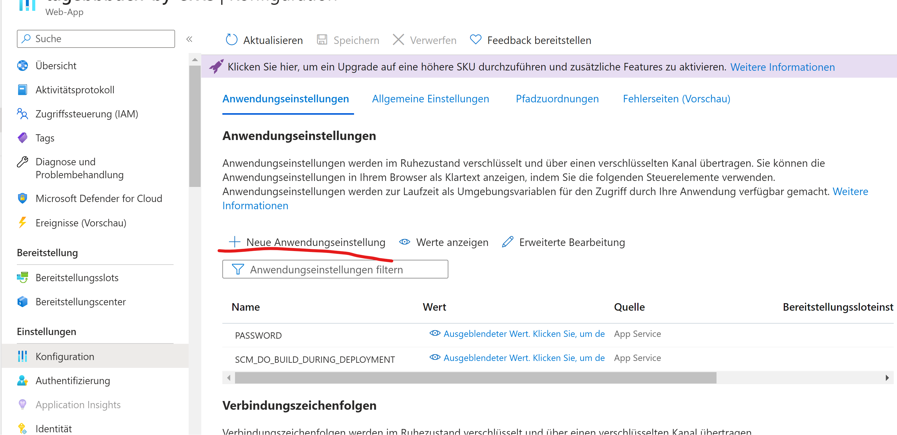
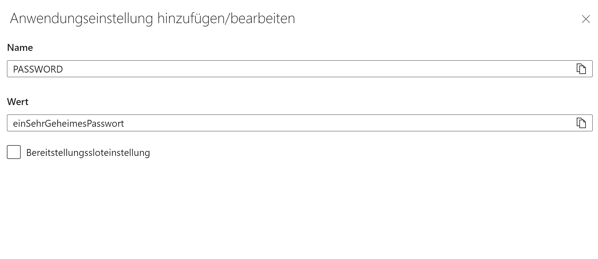

# LB 324

## Aufgabe 2

Erklären Sie hier, wie man `pre-commit` installiert.

### Erklärung:

1. Installieren Sie zuerst das `pre-commit` Paket mit dem folgenden Befehl:

   ```
   pip install pre-commit
   ```

2. Fügen Sie anschließend die folgenden Konfigurationen in Ihre `.pre-commit-config.yaml` Datei ein:

   ```yaml
   - repo: local
     hooks:
       - id: pytest-check
         stages: [push]
         types: [python]
         name: pytest-check
         entry: python -m pytest
         language: system
         pass_filenames: false
         always_run: true
   ```

3. Führen Sie zuletzt den folgenden Befehl aus, um `pre-commit` zu installieren und die Hooks für `pre-commit` und `pre-push` hinzuzufügen:

   ```
   pre-commit install --hook-type pre-commit --hook-type pre-push
   ```

Danach muss der Programmierer nur noch committen, und nach dem Pushen wird der Code automatisch getestet. Der Programmierer muss die Tests nicht selbst ausführen, da die `.pre-commit-config.yaml` so konfiguriert wurde, dass bei jedem Commit die Tests automatisch durchgeführt werden.

## Aufgabe 4

Erklären Sie hier, wie Sie das Passwort aus Ihrer lokalen `.env`-Datei auf Azure übertragen.

1. Gehen Sie zunächst zu Azure, melden Sie sich an und navigieren Sie zu den Konfigurationseinstellungen, wie im Bild unten dargestellt:

   

2. Fügen Sie dann die Werte aus Ihrer `.env`-Datei in die entsprechenden Felder auf Azure ein:

   

Durch diese Schritte habe ich das das Passwort aus meiner Lokalen `.env`-Datei auf Azure eingefügt.
